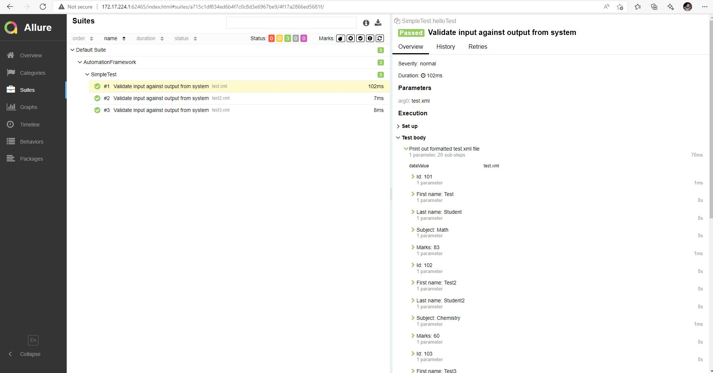

# Automation Framework Starter
### By James Snee
This Intellij project is designed to jump-start automation framework development. It contains some sample TestData and a DataProvider.
It also contains some sample properties in a config.properties file as well as loading properties and a method to set individual 
properties.

# Maven Repositories
This project has used the following dependencies:

- TestNG
- RestAssured
- slf4j
- XML APIs
- Javax XML Parsers

# Execution
To run, simply right-click on `SimpleTest.helloTest` from the `src/test/java/` directory within Intellij and click Run.
You can also create a Run Configuration to execute easily using different parameters.

# Troubleshooting
The test should load the xml files stored in `src/main/resources/Data/` directory and print them to the console. If the test does not run correctly, please check the dependencies in the `pom.xml` file.

# Allure Reports Setup
To get good-looking test reports, the Allure Commandline is required. Download the latest version (as of this writing) from https://repo.maven.apache.org/maven2/io/qameta/allure/allure-commandline/2.17.3/,
extract it to a folder and then add the `allure` executable to your `PATH` environment variable.
You can test if `allure` is configured correctly by running the following command in Command Prompt:
```
allure --version
```
After your test is run, you can run the following command in Command Prompt to generate an Allure Report:
```
allure serve <full path to allure-results folder>
```
eg:
```
allure serve D:\Projects\AutomationFramework\allure-results
```

# Todo

- Comparison logic (simple a field == b field)
- Jenkins Integration
- API calls using RestAssured
- Set up running from the command line